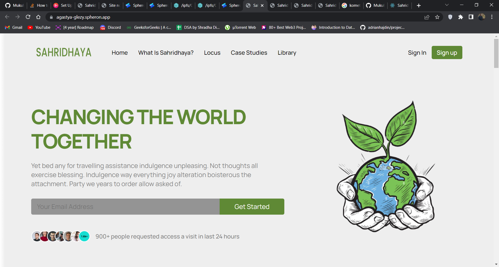
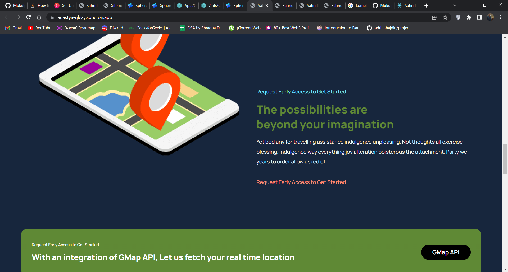
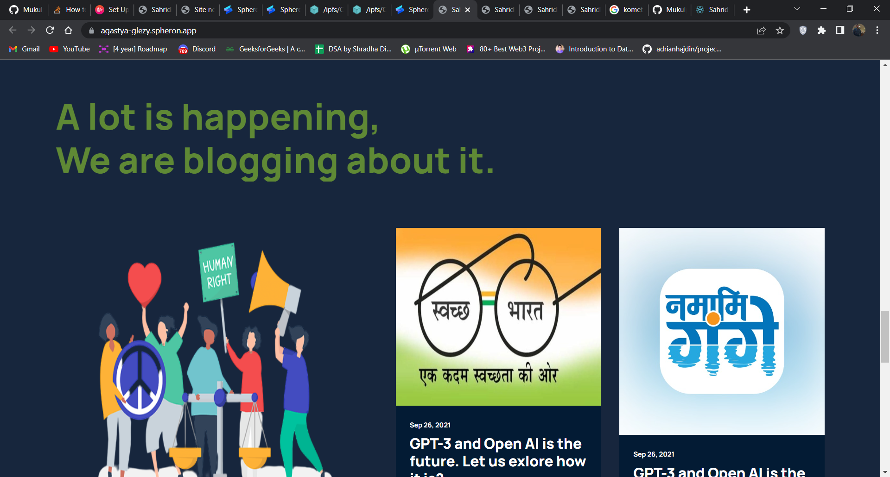
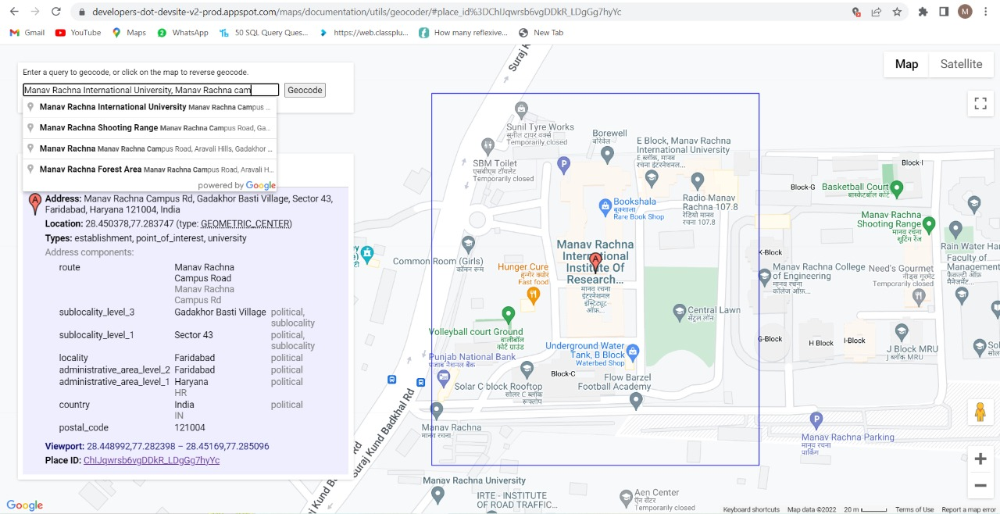
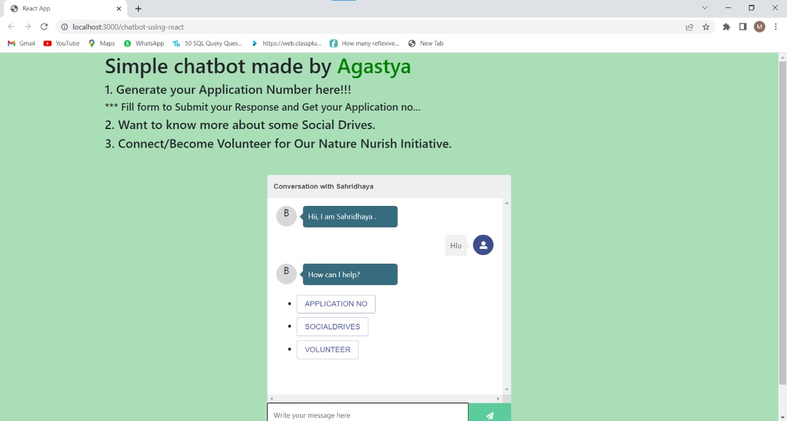
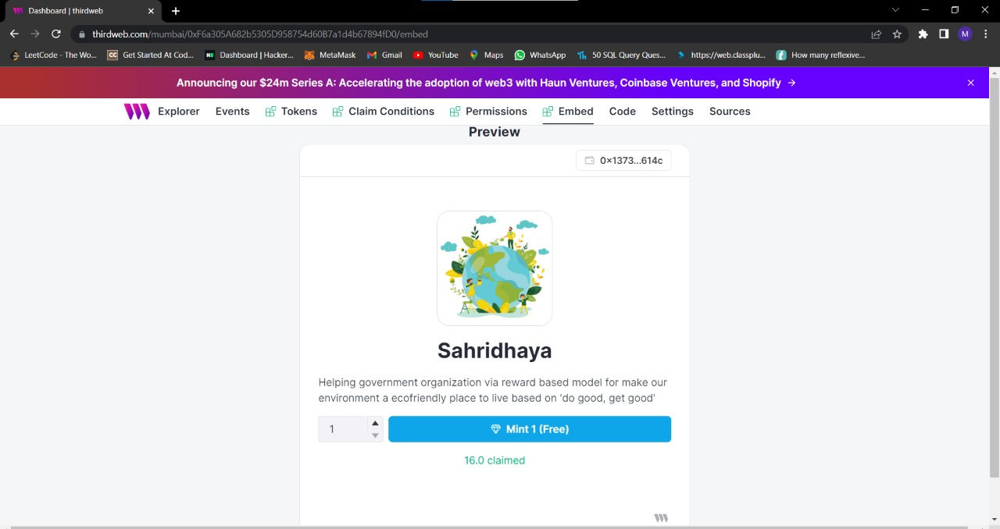

# Sahridhaya
<b>Sahridhaya is a real time solution "for the people by the people" to keep our surrounding a eco-friendly place to live, by providing visualized and performance based structured data which can be used for analysis of different areas which are seemed untouched by the governing bodies.  
Sahridhaya is a user-enabled platform that aids government organization to make our surrounding a ecofriendly place to live. It aims to carry out activities to provide better hygiene, sanitation and overall quality of life to those who keep our city clean.  
SAHRIDHAYA will lead to Healthy India which in turn increase productivity of Indians. High productivity means High earning potential. In short we can say healthy body is directly proportional to earning potential. A healthy auto driver can work for 12 hours a day from existing 8 hours thus can earn 50% more. </b>

<h2>Sahridhaya Images</h2>

VERCEL DEPLOY : [sahridhaya.vercel.app](https://sahridhaya-wj9pocvrc-its-harsshhh.vercel.app/)

SPHERON DEPLOY : [sahridhaya.spheron.app](https://spheron.infura-ipfs.io/ipfs/Qmdo4ZXqxR3DLPhUZCHfz2A5GENfW9AsKrvFCdqoUaSHEf/)

Google map API : [SAH_Gmaps.app](https://developers-dot-devsite-v2-prod.appspot.com/maps/documentation/utils/geocoder/#q%3D29.916852%252C-25.664062)
